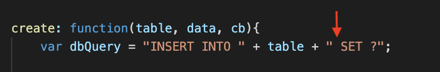

# to-do-list

​
## Getting Started

Steps:
1) make your way to the GitHub repository (link provided at the bottom of this document) and clone yourself a copy somewhere on your computer.
(personally i prefer to make a folder on the desktop and place it there.)
To clone:
- simply select the link provided (clone) and copy it.
- open terminal or git bash (for you fancy windows peeps) and do the following: git clone (link goes here) <-- at the location of your choosing

2) open within VS Code or any code-viewing app you have/prefer
3) within the terminal, go ahead and perform an npm install to get all those pretty folders (node_modules)
- these are needed for the app to work.

4) in the terminal, type node server.js to intiate the server (locally)
5) go to the localhost (typing localhost:8080 in your browser) and experience the magic of servers and my mad skill.

##  How i did this!

Oddly enough, with most projects i tend to spend only about an hour or less just working through how its going to work, or occasionally as i work through the styling design (which i used to begin a project with), psudo coding things out and overall planning/prep. However, for this project i took a bit more time...somewhere close to 5 or 6 hours in total. I spent this time reviewing related projects and similar activities and, an even greater surprise: i saved the styling for last! Crazy! This actually helped me a LOT but was likely only an option because i had a lot of time to spare (worked on this over a 3 day weekend).

Overall, this project was very intimidating to start as it involved more files and folders than any previous project i've worked on, each with dignificance to the overall functionality of the app. Failure or even a simple mistake on any page, anywhere would result in everything breaking...no pressure or anything. With this in mind, i started with what i knew and that was what files and folders i would need. Once made and organized, i began working on establishing the server. From there i worked on files within the config folder (connection.js & orm.js) followed by the controllers (taskController.js) and then models (task.js). I basically worked through all the backend first, insuring functionality first above all else and then worrying about the styling later. Of course, i took occasional breaks to work on styling and step away from the backend coding for a bit as it can be VERY overwhelming, but even then i maintained a strong focus towards functionality.

It's hard to track what exactly i worked on and when but i can definitely say where i encountered issues and what was done to correct them.
The first challenge i encountered was not displaying current tasks but actually with completing them.

image of where completed tasks display...

The process of completing a task involves the user selecting a task from the created list, pressing the green check-mark button and then moving it to the right box to indicate that the task has been completed. From there the user may delete completed tasks. My initial issue here was getting tasks from the created list to the completely list. This involved going through my code, every single page and line, followed by a great deal of googling. Eventually i found the proper way to do it but it certainly took a good amount of time.

Next i began working on actually Creating new tasks. This i actually spent an entire day trying to fix before eventually consulting a class TA (Kerwin) for help. He helped me sort through my code and revise parts of it which helped us to detect a very small but significant error...a missing space (" ") within the orm.js create function. OF ALL THINGS! Thats life as a programmer though. One small thing can break everything. Corrected this and the create function worked perfectly.

image of where the missing space was located...

image of where created tasks are made...

image of where created tasks display...

From there i had only the Delete function to worry about which had an almost equally frustrating and simple solve that i found after talking to a fellow classmate (chris Melby) who then showed me his delete function.

as the image below displays, the correct syntax involves "affectedRows" where i previously had "changedRows". From there, everything worked perfectly and i began working on the styling.

Styling for me tends to be the easiest part as i really enjoy it. Per the usual, i wanted a simple design with an interesting background and related coloring within the main content display. This time i decided to use a little bit of Bootstrap to make things easier but still incorporated a lot of css styling to give it the look i wanted. As always, the only styling challenge i encountered was with screen sizing to for moble versions but this didn't prove too dificult when using a bootstrap container. Will probably start using intuitive outside styling like this in the future.

My final challenge came when deploying the app on Heroku. There were many steps involved and complexities when adding a database/connecting to mysql workbench. HUGE THANK YOU to my class TA Kerwin who helped me through this process.

And thats my App!

Closing statement: This project was quite a challenge. As per the usual, i was completely unaware until the due day that a majority of the content had actually been provided but, having writen everything out myself, i suppose i'll retain more of what i did here in the end. I learned a lot and i look forward to utilizing this knowledge in future projects.

## Built With
​
* [HTML](https://developer.mozilla.org/en-US/docs/Web/HTML)
* [CSS](https://developer.mozilla.org/en-US/docs/Web/CSS)
* [Javascript](https://developer.mozilla.org/en-US/docs/Web/JavaScript)
* [Express.js](https://expressjs.com/)
* [Express-handlebars.js](https://www.npmjs.com/package/express-handlebars)
* [MySQL](https://www.mysql.com/)
​
​
## Authors
​
* **Casey Moldavon** 

For live Demo...
- [Live Heroku app](https://casey-bucket-list.herokuapp.com/)
​
- [Link to Portfolio Site](https://casey-moldavon.github.io/updated-portfolio-page/)
- [Link to Github](https://github.com/casey-moldavon/to-do-list)
- [Link to LinkedIn](https://www.linkedin.com/in/casey-moldavon-442a1761/)
​
See also the list of [contributors](https://github.com/your/project/contributors) who participated in this project.
​
## License
​
This project is licensed under the MIT License 
​
## Acknowledgments
​
* HUGE thanks to my class TA Kerwin who helped me through a complex issue with my project (Adding tasks and sorting my CRUD Create function) and deploying on Heroku. His help along with a very brief but helpful glance at code belonging to a classmate (Chris Melby) helped me finish the functionality of the project. As always, a big thanks the class isntructor Jerome Chenette and my husband Teddy (who supports me and puts up with my constant studying).